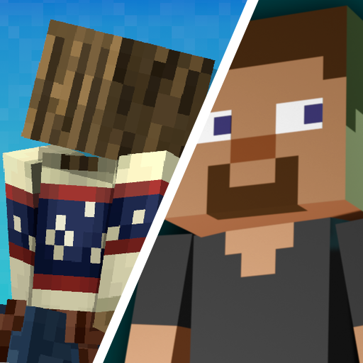

<table>
  <tr>
    <td>
      
    </td>
    <td>
      This is an unofficial resource pack that merges the eye animations from Fresh/Expressive Moves with the player body animations from Detailed Animations Reworked for Minecraft 1.21.x. I merely combined them for my own use and decided to share with the community.
    </td>
  </tr>
</table>

## Disclaimer and Copyright Notice:

1. **All copyrights** of the original resources (models, textures, animations) belong to their respective creators:
    Fresh Moves: Author(s) – [TrasTick](https://modrinth.com/user/TrasTick), mod on [modrinth page](https://modrinth.com/resourcepack/tras-fresh-player).
    Detailed Animations Reworked: Author(s) – [Cymock](https://www.youtube.com/@Cymock1), mod on [modrinth page](https://modrinth.com/resourcepack/detailed-animations).
3. I am not the author of the above-mentioned resources and have no direct connection to them.
4. I take no responsibility for any bugs, incompatibilities, or other issues that may arise from using this combined pack.
5. This resource pack was made to **solve my own compatibility** issue. I do not claim any credit that belongs to the original authors.
6. If you have questions or concerns about the original packs, please contact their authors (if possible).

## Installation Instructions
1. Download the ZIP file of this resource pack.
2. Place it in your Minecraft resourcepacks folder.
3. Enable it in-game via “Options” → “Resource Packs.”
4. Make sure you have OptiFine or another mod that supports .jem/EMF models (if required).
5. Arrange this resource pack above (or below) others depending on how you want the assets to be overridden. (Usually putting it on top means it overrides lower packs.)

___
Enjoy the game!
